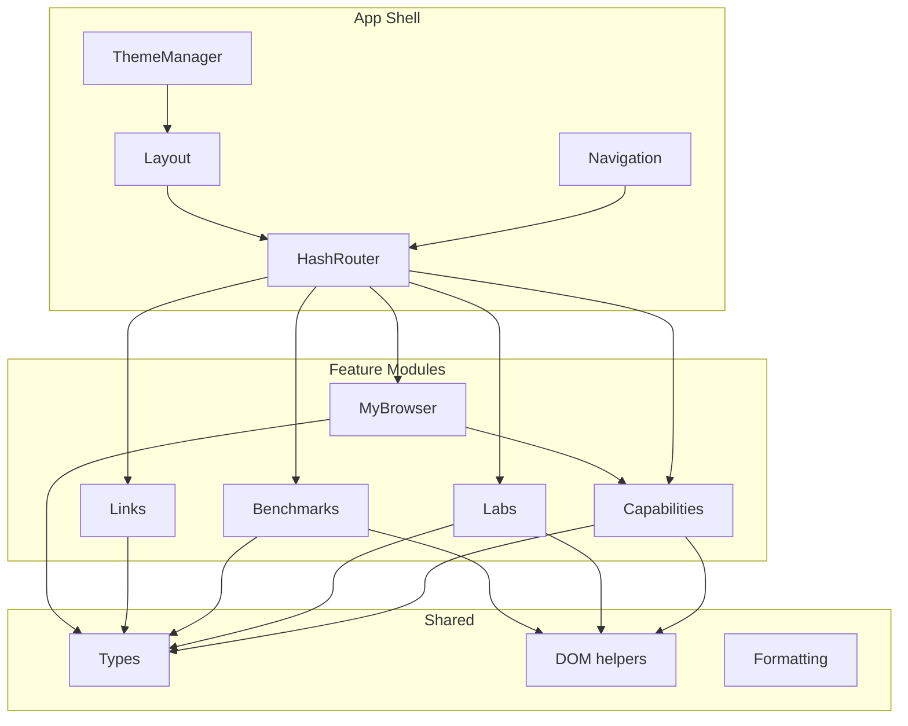
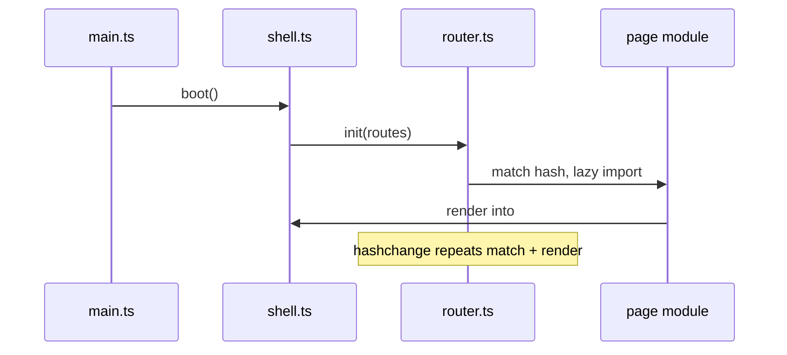
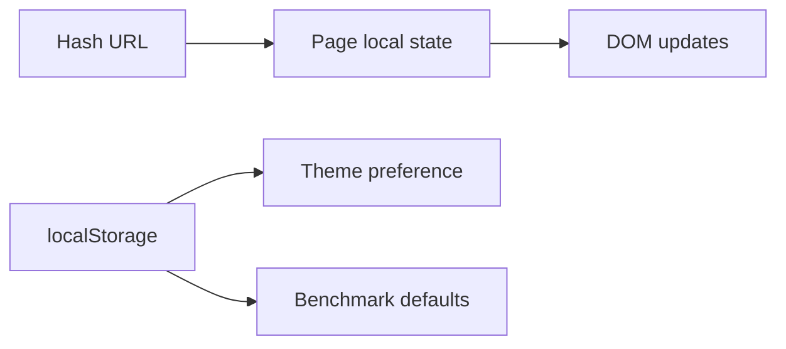

# WebProbe — Architecture

Technical architecture for WebProbe, a framework-free TypeScript application built with Vite and deployed as static assets.

Related: [PLAN.md](./PLAN.md) | ADRs: [adr/](./adr/)

---

## Design principles

1. **Browser-native first** — prefer platform APIs over libraries.
2. **Small modules** — feature folders, minimal cross-coupling.
3. **Explicit uncertainty** — capabilities and browser info model unknown/unavailable states.
4. **Lazy by default** — labs and heavy pages load on demand.
5. **Static and hostable** — no server required for MVP.
6. **Easy to extend** — registries and manifests make additions predictable.

---

## System overview



Data flows inward: the shell routes to feature modules; features use shared types and DOM helpers; `My Browser` may read from the capability registry for a summary view.

---

## Repository layout

```text
webprobe/
├── docs/
│   ├── PLAN.md
│   ├── ARCHITECTURE.md
│   └── adr/
├── public/
│   └── favicon.svg
├── src/
│   ├── main.ts                 # entry: boot shell
│   ├── app/
│   │   ├── shell.ts            # mount app into #app
│   │   ├── router.ts           # hash router
│   │   ├── routes.ts           # route table
│   │   ├── navigation.ts       # nav rendering
│   │   └── pages/
│   │       ├── overview.ts
│   │       └── not-found.ts
│   ├── capabilities/
│   │   ├── registry.ts
│   │   ├── types.ts
│   │   ├── detectors/
│   │   │   ├── webgpu.ts
│   │   │   ├── web-workers.ts
│   │   │   └── ...
│   │   └── pages/
│   │       ├── index.ts
│   │       └── detail.ts
│   ├── labs/
│   │   ├── registry.ts
│   │   ├── types.ts
│   │   ├── worker-vs-main/
│   │   ├── indexeddb-rw/
│   │   └── compression-streams/
│   ├── benchmarks/
│   │   ├── registry.ts
│   │   ├── runner.ts
│   │   ├── types.ts
│   │   └── worker-roundtrip/
│   ├── links/
│   │   ├── catalog.ts
│   │   ├── types.ts
│   │   └── pages/
│   │       └── index.ts
│   ├── browser/
│   │   ├── probes.ts
│   │   ├── types.ts
│   │   └── pages/
│   │       └── index.ts
│   ├── components/
│   │   ├── status-badge.ts
│   │   └── page-header.ts
│   ├── shared/
│   │   ├── dom.ts
│   │   ├── format.ts
│   │   ├── storage.ts
│   │   └── types.ts
│   └── styles/
│       ├── tokens.css
│       ├── themes.css
│       └── global.css
├── tests/
│   ├── unit/
│   └── e2e/
├── index.html
├── package.json
├── tsconfig.json
├── vite.config.ts
└── vitest.config.ts
```

`tests/` sits at repo root to keep `src/` focused on application code.

---

## App shell

### Responsibilities

- Mount into `#app` from `index.html`
- Render persistent header, navigation, and footer
- Delegate `#main` content to the active route handler
- Manage theme class on `document.documentElement`
- Handle `hashchange` and initial route resolution

### Lifecycle



Each page export follows:

```ts
export function render(container: HTMLElement): () => void;
```

The returned cleanup removes listeners and aborts in-flight work.

---

## Routing

### Hash router

```ts
interface Route {
  path: string; // e.g. '/capabilities/:id'
  load: () => Promise<{ render: (el: HTMLElement) => () => void }>;
}

interface Router {
  start(): void;
  navigate(path: string): void;
  getCurrentPath(): string;
  getQuery(): URLSearchParams;
}
```

- Base path: `#/` (default overview)
- Param matching: simple segment parser (`:id` → one segment)
- Query string: `#/links?category=performance`
- Unknown routes → not-found page

### Route table (MVP)

| Path                | Module                         |
| ------------------- | ------------------------------ |
| `/`                 | `app/pages/overview.ts`        |
| `/capabilities`     | `capabilities/pages/index.ts`  |
| `/capabilities/:id` | `capabilities/pages/detail.ts` |
| `/labs`             | `labs/pages/index.ts`          |
| `/labs/:id`         | `labs/pages/detail.ts`         |
| `/benchmarks`       | `benchmarks/pages/index.ts`    |
| `/benchmarks/:id`   | `benchmarks/pages/detail.ts`   |
| `/links`            | `links/pages/index.ts`         |
| `/my-browser`       | `browser/pages/index.ts`       |

ADR: [002-static-hash-routing.md](./adr/002-static-hash-routing.md)

---

## Rendering

### DOM helpers (`shared/dom.ts`)

Minimal utilities — not a framework:

```ts
function el<K extends keyof HTMLElementTagNameMap>(
  tag: K,
  attrs?: Record<string, string>,
  ...children: (Node | string)[]
): HTMLElementTagNameMap[K];

function on(target: EventTarget, type: string, handler: EventListener): () => void;
```

### Page rendering rules

- Build DOM with `el()` or `document.createElement`; avoid `innerHTML` for dynamic user content.
- Static copy may use template literals rendered once into known-safe fragments.
- Prefer `<dl>` for key-value displays (My Browser, benchmark results).
- Use `<output>` or `aria-live="polite"` regions for async lab/benchmark updates.

### Web Components

Consider only when the same interactive UI appears in 3+ places:

- `<wp-status-badge>` — capability/benchmark status
- Optional `<wp-result-panel>` — benchmark output container

Keep components leaf-level; pages remain plain TypeScript.

ADR: [001-framework-free-vite-app.md](./adr/001-framework-free-vite-app.md)

---

## State management



| Concern          | Mechanism                                           |
| ---------------- | --------------------------------------------------- |
| Theme            | `localStorage` key `wp-theme`, `data-theme` on root |
| Route            | `location.hash`                                     |
| Filters          | URL query params                                    |
| Lab/benchmark UI | Closure variables + cleanup on unmount              |
| Detection cache  | None globally; per-page memo if needed              |

No event bus, no global store, no reactive runtime.

---

## Capability system

### Registry

```ts
interface CapabilityDefinition {
  id: string;
  title: string;
  description: string;
  category: CapabilityCategory;
  docsUrl: string;
  notes: string[];
  labId?: string;
  detect: () => CapabilityResult | Promise<CapabilityResult>;
}
```

### Detection guidelines

| Confidence     | When to use                                                              |
| -------------- | ------------------------------------------------------------------------ |
| `detected`     | Direct feature test succeeded (e.g. `typeof Worker !== 'undefined'`)     |
| `inferred`     | Indirect signal (e.g. engine guess from userAgent — avoid when possible) |
| `approximated` | Rounded or browser-reported estimate (e.g. `deviceMemory`)               |
| `unavailable`  | API not exposed; do not guess                                            |

Always prefer `unknown` over false precision.

### Example: WebGPU

```ts
function detectWebGpu(): CapabilityResult {
  if (!('gpu' in navigator)) {
    return {
      status: 'unsupported',
      confidence: 'detected',
      summary: 'navigator.gpu is not exposed.',
    };
  }
  return {
    status: 'supported',
    confidence: 'detected',
    summary: 'WebGPU API is exposed.',
    notes: [
      'Exposure does not guarantee a usable adapter or feature set.',
      'Run the WebGPU lab (post-MVP) for deeper validation.',
    ],
  };
}
```

---

## Lab system

### Manifest

```ts
interface LabManifest {
  id: string;
  title: string;
  description: string;
  category: 'compute' | 'storage' | 'graphics' | 'network' | 'media' | 'other';
  requiredCapabilities: string[];
  route: string;
  docs: { title: string; url: string }[];
  load: () => Promise<{ default: LabModule }>;
}

interface LabContext {
  signal: AbortSignal;
  report: (message: string) => void;
}

interface LabModule {
  mount(container: HTMLElement, context: LabContext): () => void;
}
```

### Lab page flow

1. Resolve lab by `:id` from registry
2. Check `requiredCapabilities` against capability registry
3. If unsupported → render unsupported state with links to capability pages
4. Dynamic `import()` lab module
5. Call `mount` with `AbortController.signal`
6. On route change → cleanup()

### Adding a lab

1. Create folder `src/labs/my-lab/`
2. Export `LabModule` from `index.ts`
3. Add manifest entry in `src/labs/registry.ts`
4. Add route entry if needed (convention: `/labs/:id` handles it)
5. Add Vitest tests for any pure logic; Playwright optional for interactive labs

---

## Benchmark system

### Runner (`benchmarks/runner.ts`)

```ts
interface BenchmarkConfig {
  name: string;
  warmupIterations: number;
  measuredIterations: number;
  signal: AbortSignal;
  runIteration: () => void | Promise<void>;
}

interface BenchmarkResult {
  name: string;
  unit: string;
  values: number[];
  median: number;
  p95: number;
  iterations: number;
  durationMs: number;
  notes: string[];
  environment: Record<string, string | number | undefined>;
}

async function runBenchmark(config: BenchmarkConfig): Promise<BenchmarkResult>;
```

### Runner behavior

- Warmup iterations excluded from results
- Each measured iteration timed individually
- Abort throws `DOMException` with name `AbortError` — caught and surfaced as cancelled
- Median and p95 computed from measured values only
- Environment snapshot captured once per run

### Benchmark module contract

Same pattern as labs: manifest in registry, `run()` function exported, page wraps runner UI (start, stop, progress, results).

### First benchmark: worker round-trip

- Spawn inline worker via blob URL or dedicated worker file
- Payload: small structured-clone-friendly object
- Measure round-trip time per message
- Notes: GC effects, timer resolution, main-thread scheduling

---

## Links catalog

### Data model

```ts
type LinkCategory =
  | 'browser-apis'
  | 'typescript'
  | 'performance'
  | 'accessibility'
  | 'testing'
  | 'css'
  | 'security'
  | 'developer-tools';

interface CuratedLink {
  id: string;
  title: string;
  url: string;
  description: string;
  category: LinkCategory;
  tags: string[];
  official: boolean;
  featured?: boolean;
}
```

### Page behavior

- Category filter via URL query or sidebar buttons
- Search filter client-side on title/description/tags
- Featured links highlighted on overview and links page
- External links: `rel="noopener noreferrer"`, visual external indicator

### Validation (`tests/unit/links.test.ts`)

- Unique `id` and `url`
- Valid URL format
- Description length ≥ 20 characters
- Category is known enum value
- Warn if category exceeds 12 links (soft limit in test message)

---

## My Browser

### Probe model

```ts
interface BrowserInfoField<T = string> {
  label: string;
  value: T | null;
  confidence: Confidence;
  source: string;
  notes?: string;
}

interface BrowserInfoReport {
  generatedAt: string;
  fields: BrowserInfoField[];
  capabilitySummary: { id: string; status: CapabilityStatus }[];
}
```

### Probes (`browser/probes.ts`)

| Field            | Source                                                      | Confidence              |
| ---------------- | ----------------------------------------------------------- | ----------------------- |
| Platform         | `navigator.userAgentData?.platform` or `navigator.platform` | detected / inferred     |
| CPU cores        | `navigator.hardwareConcurrency`                             | detected                |
| Device memory    | `navigator.deviceMemory`                                    | approximated (Chromium) |
| Viewport         | `window.innerWidth/innerHeight`                             | detected                |
| Screen           | `screen.width/height`                                       | detected                |
| DPR              | `window.devicePixelRatio`                                   | detected                |
| Network          | `navigator.connection`                                      | detected / unavailable  |
| Storage estimate | `navigator.storage.estimate()`                              | approximated            |

### Privacy UI

- Banner explaining local-only collection
- Group fields by confidence
- No copy-to-clipboard of full report in MVP (post-MVP optional)

---

## Styling

### CSS structure

- `tokens.css` — spacing, typography, colors as CSS custom properties
- `themes.css` — `[data-theme="light"]` / `[data-theme="dark"]` overrides
- `global.css` — reset, base typography, layout utilities

### Design direction

- Developer-tool aesthetic: monospace accents, clear hierarchy, not a SaaS dashboard
- Responsive: single-column on narrow viewports; side nav collapses to menu button
- Focus styles never removed
- Status colors: supported (green), unsupported (muted), unknown (amber)

---

## Accessibility

- Skip link to `#main`
- `nav` with `aria-current="page"` on active item
- All interactive elements reachable by Tab
- Benchmark/lab controls: labels, `aria-busy` during runs
- Live regions for result updates
- Color not sole indicator of status (icons/text alongside)

---

## Testing architecture

```text
tests/
├── unit/
│   ├── capabilities/
│   ├── benchmarks/
│   ├── links/
│   └── browser/
└── e2e/
    ├── navigation.spec.ts
    ├── capabilities.spec.ts
    └── labs.spec.ts
```

Vitest runs in Node with jsdom only for DOM-free logic. Browser-specific detectors are tested by mocking `globalThis`. Playwright runs against `vite preview` for local or scripted browser checks.

---

## Build and deployment

### Vite config essentials

```ts
export default defineConfig({
  base: process.env.BASE_PATH ?? '/',
  build: { outDir: 'dist', sourcemap: true },
});
```

Use the default `/` base path for normal static hosting. Set `BASE_PATH` only when serving the app from a subdirectory.

### Output

Static `dist/` — `index.html`, hashed assets, no server code.

---

## Extension points (intentionally simple)

| Add        | Touch                               |
| ---------- | ----------------------------------- |
| Capability | `detectors/`, `registry.ts`         |
| Lab        | `labs/<name>/`, `registry.ts`       |
| Benchmark  | `benchmarks/<name>/`, `registry.ts` |
| Link       | `catalog.ts`                        |
| Page       | `routes.ts`, feature `pages/`       |

No code generation, no CLI scaffolding for MVP.

---

## What we deliberately avoid

- Angular, React, Vue, Svelte, Solid
- State management libraries
- CSS frameworks (Bootstrap, Tailwind) — custom tokens keep weight low
- Router libraries for MVP
- Backend, BaaS, auth, database
- Universal benchmark scoring
- Plugin runtime loading from third-party URLs

---

## ADRs

| ADR                                         | Decision                         |
| ------------------------------------------- | -------------------------------- |
| [001](./adr/001-framework-free-vite-app.md) | Framework-free TypeScript + Vite |
| [002](./adr/002-static-hash-routing.md)     | Static hosting with hash routing |
